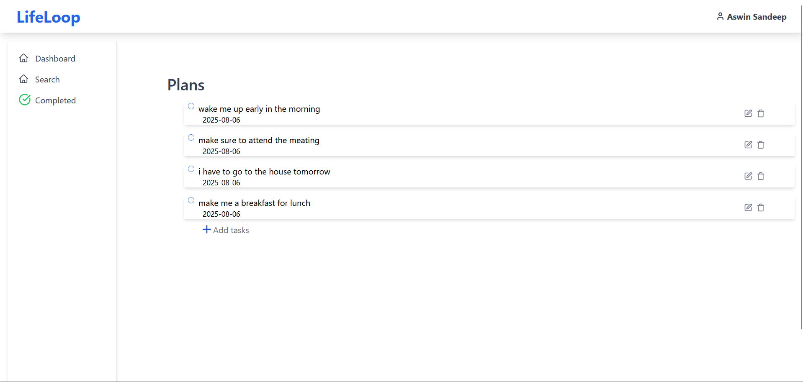
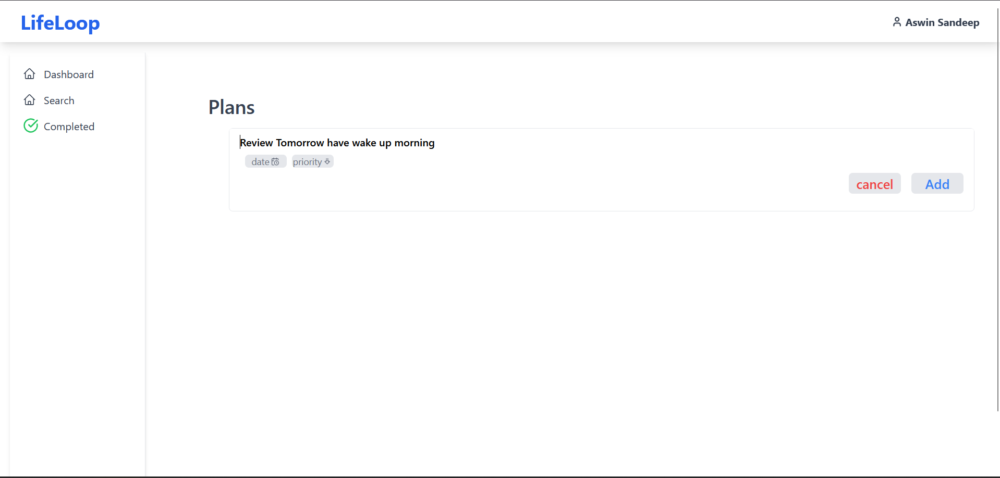
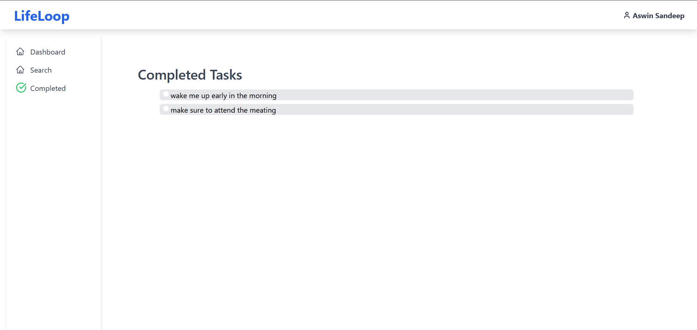

# 📝 ToDo App — React + FastAPI

A simple full-stack **ToDo Application** built to demonstrate CRUD operations using **React (Frontend)** and **FastAPI (Backend)**. The project emphasizes clean code, modular structure, API communication, and a smooth user interface — ideal for learning full-stack development basics.

---

## 📸 Screenshots

> Add your app screenshots in the `/screenshots` folder and update the image paths below.





---

## 🚀 Features

- ➕ Add new tasks
- ✅ Mark tasks as completed
- 📝 Update task description
- ❌ Delete tasks
- 🔁 Refresh & sync with backend
- 🔗 React Router navigation
- 📡 Axios communication between React and FastAPI
- 💾 Database integration with SQLite or PostgreSQL

---

## 🧠 Concepts Used

### 🔹 Frontend (React)

- Functional components & Hooks (`useState`, `useEffect`)
- State lifting & prop drilling
- Axios for HTTP requests
- Routing with React Router DOM
- Minimalistic and clean UI design

### 🔹 Backend (FastAPI)

- RESTful API endpoints (`GET`, `POST`, `PUT`, `DELETE`)
- **Pydantic** for data validation
- **SQLite** / **PostgreSQL** for persistent data
- CORS Middleware for frontend-backend integration
- Auto-generated OpenAPI docs at `/docs`

---

## 🛠️ Tech Stack

| Tech            | Purpose             |
|-----------------|---------------------|
| React           | Frontend UI         |
| FastAPI         | Backend API         |
| Axios           | HTTP Communication  |
| React Router    | Client-side Routing |
| SQLite/PostgreSQL | Database           |
| Pydantic        | Data validation     |
| Python          | Backend Language    |
| JavaScript      | Frontend Language   |

---

## 📁 Project Structure

```bash
📦 todo-app/
├── backend/
│   ├── main.py             # FastAPI app entry
│   ├── models.py           # Pydantic models
│   ├── database.py         # DB connection
│   ├── crud.py             # CRUD operations
│   └── requirements.txt    # Backend dependencies
├── frontend/
│   ├── src/
│   │   ├── components/     # TaskCard, TaskForm, etc.
│   │   ├── pages/          # Home, NotFound, etc.
│   │   ├── services/       # Axios functions
│   │   ├── App.js
│   │   └── index.js
│   └── package.json
└── README.md
